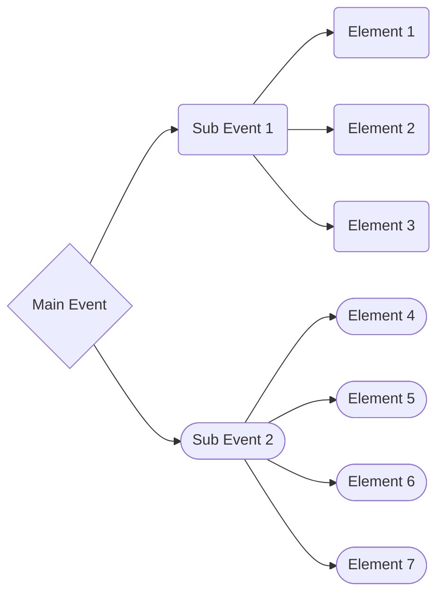
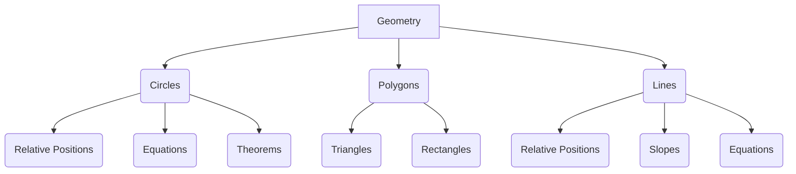
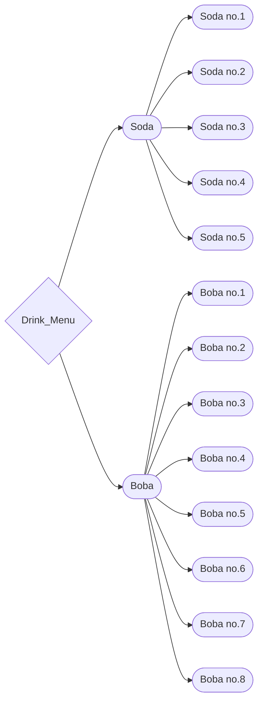
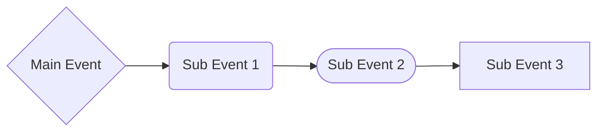
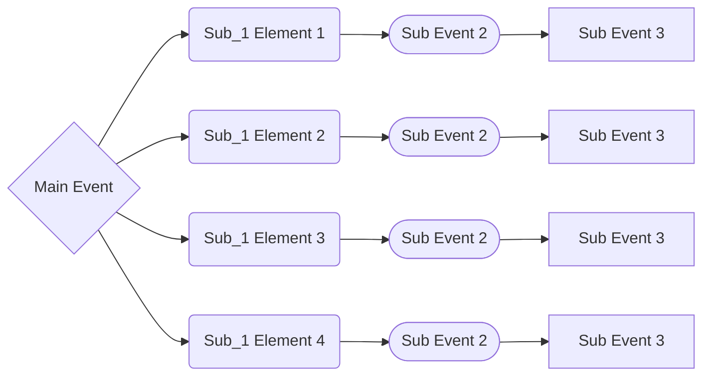
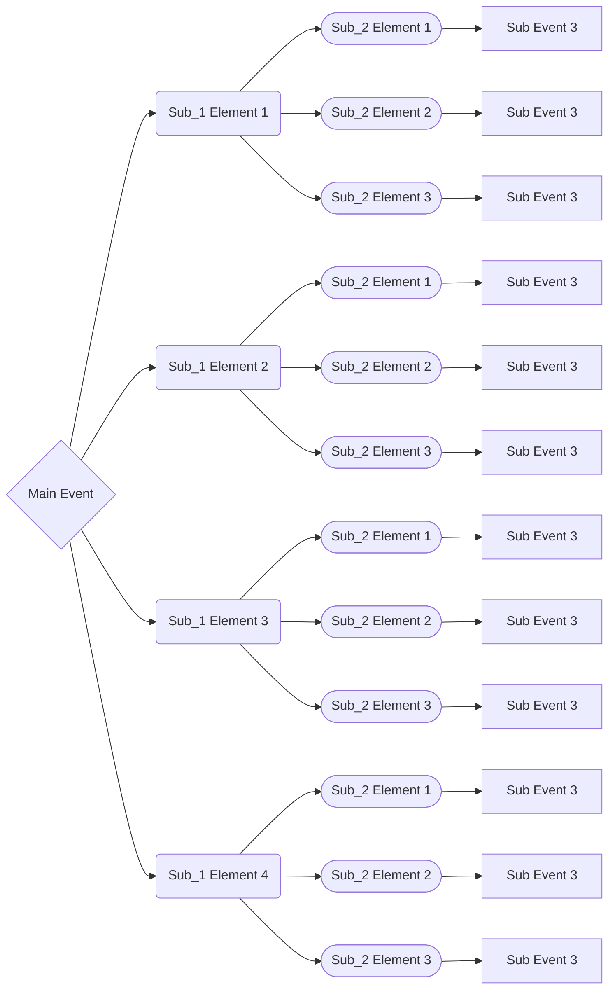

## Introduction
From thousands of years ago, we developed Mathematics 

## Tree Diagram
### What is tree diagram
As things get more complex, we are required an effective tool to organise and visualise objects. Diagrams satisfy both requirement. Consequently, Diagrams are delevloped and used as one way for counting. One of them is tree diagram, an early and well-used one due to its simplicity.

### Example

### Tree diagram in counting
## Addition Principle 
### Statement  
If one event can occur in $m$ ways and a second event with no common outcomes can occur in $n$ ways, then the first or second event can occur in $m+n$ ways.
### Example 1 - Addition Priciple
#### Problem
In how many ways can we get a drink from a menu with 5 soda options and 8 boba options.
#### Solution
Event "we get a soda" can occur in 5 ways and event "we get a boba" can occur in 8 ways. If we get a drink, it has to be from the menu ,or more precisely, either from the soda options or the boba options. Since these two events contribute to form a bigger event which is "we get a drink", according to addition principle, total ways for event "we get a drink" to occur are $5+8=13$ ways 

Making a tree diagram like figure above, you can easily find how many outcomes there are just by normal counting.

## Multiplication Principle
### Statement
If one event can occur in $m$ ways and a second event can occur in $n$ ways __*after the first event has occurred*__, then the two events can occur in $m \cdot n$ ways.

Each Sub Event contains elements from its set. In fact, if we "unbox" a subset , it would look like this (the figure below show subset/subevent 1 with 4 elements)

"Unbox" both subevent 1 and 2

### Explanation
As you see in the figure above, each element in Sub event 1 can be paired with 1 of the elements in Sub event 2. If there are n elements (or n ways in counting) in Sub event 2, you can pair it with one of the one of the elements in Sub event 1, which give n pairs. And since there are m elements im Sub event 1, there are m of n pairs similarly. Hence prove that the total pairs are $m \cdot n$ pair (or $m \cdot n$ ways in counting).
### Example 1 - Multiplication Principle
#### Problem
In how many ways have lunch consist of a drink from a menu with 5 soda options and 8 boba options, and a dish from the same menu with 3 vegan options and 7 non-vegan options.
#### Solution
In this problem, event "having lunch" consist of us choosing a drink and a dish, to be exact, choosing a drink *then* a dish. Consequently, such event is 2 Sub events happen in order : "get a drink" and then "get a dish". According to the principle, total ways we can have a lunch are *(number of ways to get a drink)* $\cdot$ *(number of ways to get a dish)*. We can find them using Addition Principle we established earlier. number of ways to get a drink are $5+8=13$, number of ways to get a dish are $3+7=10$. Hence the total ways to get a lunch are $13 \cdots 10=130$ ways. 

