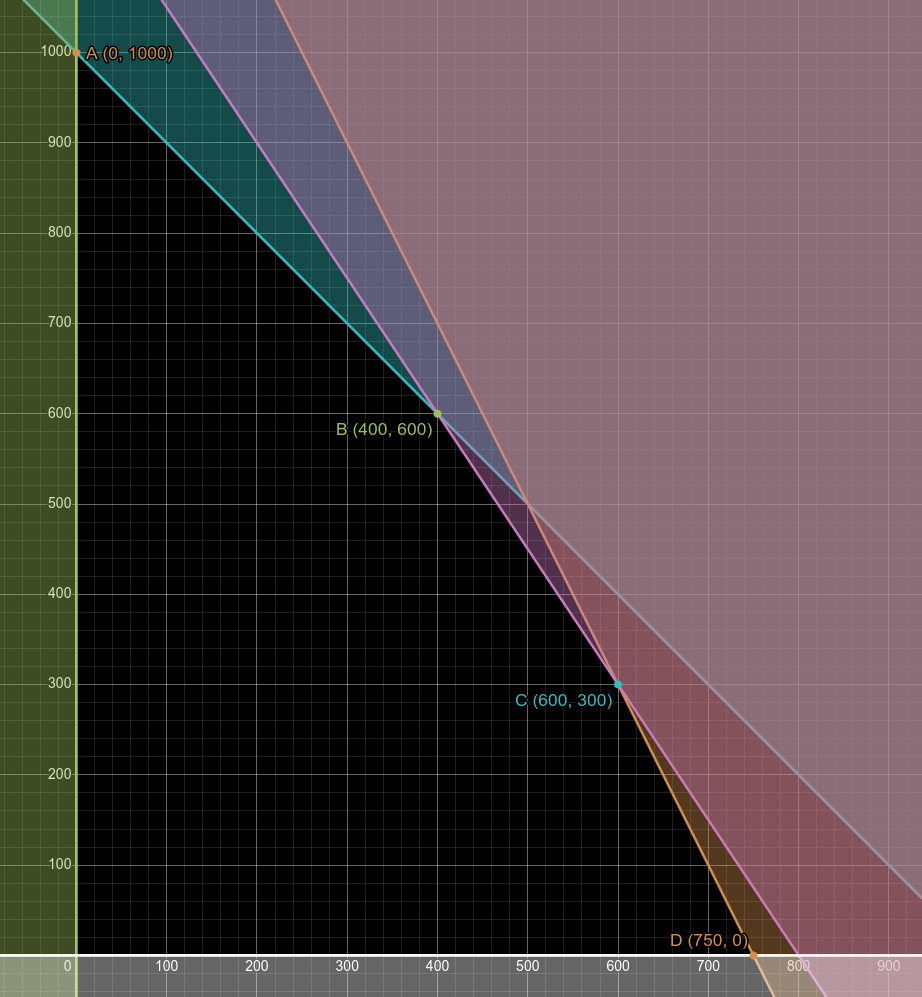
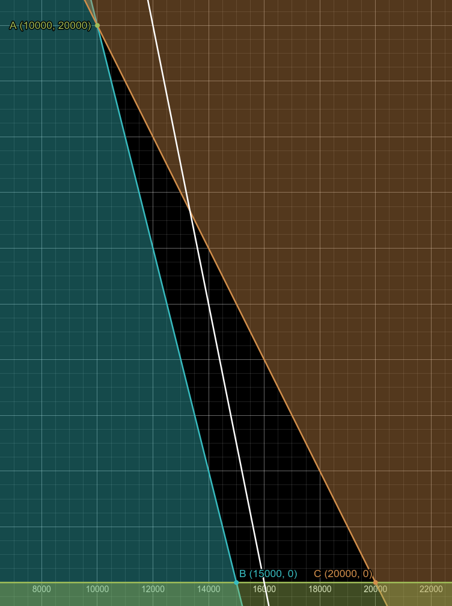
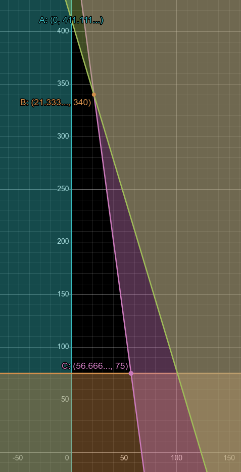

> This section is part of *Discrete Mathematics*. If you do not study that,
  you may not need to learn this.

## An introductory example

A factory produces two types of drink: an energy drink and a refresher drink.
The day's output is to be planned. Each drink requires syrup, vitamin supplement
and concentrated flavouring, as shown in the table. The last row in the table
show how much of each ingredient is available for the day's production.

| Drink Type           | Syrup (litres) | Vitamin Supplement (units) | Concentrated Flavouring (cc)    |
|----------------------|----------------|----------------------------|----------------------------------|
| Energy Drink (5l)    | 3              | 2                          | 30                               |
| Refresher Drink (5l) | 1.25           | 1                          | 20                               |
| **Available**        | 250            | 300                        | **30**

- Energy drinks sell for £1 per litre.
- Refresher drinks sell for £0.80 per litre.

 

- let $x$ represent the litres of energy drink that can be produced.
- let $y$ represent the litres of refresher drink that can be produced.

### Syrup constraint:

- 

### Constraints

- $x+y\le1000$
- $2x+y\le1500$
- $6x+4y\le4800$
- $x\ge0$
- $y\ge0$

### Objective function

- $x+0.8y$.

> We have now ***formulated*** the linear programming problem.

### Solving

- A: $x=0$, $y=1000$: $1(0)+0.8(1000)=800$
- B: $x=400$, $y=600$: $1(400)+0.8(600)=880$
- C: $x=600$, $y=300$: $1(600)+0.8(300)=840$
- D: $x=750$, $y=0$: $1(750)+0.8(0)=750$

The maximum profit is £880 at point B, where 400 litres of energy drink and 600
litres of refresher drink are produced.

## Another example

A factory produces two toys: a bicycle and a truck.
Each toy requires time on a lathe and time on an assembler, as shown in the table.
The last row in the table shows how much time is available on each machine for
the day's production.

| Toy Type      | Lathe (hours)  | Assembler (hours) |
|---------------|----------------|-------------------|
| Bicycle       | 2              | 2                 |
| Truck         | 1              | 3                 |
| **Available** | 16             | 12                |

### Constraints

- $2x+y\le16$ (lathe)
- $2x+3y\le24$ (assembler)
- $x\ge0$
- $y\ge0$

## Objective function

- $P=16x+14y$

> We have now ***formulated*** the linear programming problem.

## A third example

A wall is to be built using two types of bricks of equal thickness. The wall is
to be 3 metres high, 100 metres long and the thickness of a single brick. The
large type of brick is of height 10cm and length 20cm. The small type of brick is of height 5cm and length 10cm.

Ignoring the mortar between the bricks, the constraint $4L+s\ge60000$ ensures
that there are enough bricks to build the wall. Identify the meanings of the
variables $L$ and $S$, and explain why the constraint works.

- $L$ represents the number of large bricks used.
- $S$ represents the number of small bricks used.
- Each large brick has a face area of $10cm\times20cm=200cm^2$, or $0.02m^2$.
- Each small brick has a face area of $5cm\times10cm=50cm, or 0.005m^2$.
- So the large bricks are 4 times the area of the small bricks.
- The total area of the wall is $3m\times100m=300m^2$.
- This means that the total area of the bricks must be at least $300m^2$.
- Therefore, the constraint $0.02L+0.005S\ge300$.
- This constraint is equivalent to $4L+S\ge60000$ when both sides are multiplied
  by 200.

Each large brick needs 0.5 litres of mortar. Each small brick requires 0.25
litres of mortar.

Given that 10000 litres of mortar are available, write down a constraint for the
number of large and small bricks that can be used.

- $0.5L+0.25S\le10000$.
- Simplifies to $2L+S\le40000$

Large bricks cost 25p each to produce, and small bricks cost 5p each to produce.
Formulate a linear programming to find how many bricks of each type should be
used to build the wall as cheaply as possible.

- Let $L$ represent the number of large bricks used.
- Let $S$ represent the number of small bricks used.
- Constraints:
  - $4L+S\ge60000$
  - $2L+S\le40000$
  - $L\ge0$
  - $S\ge0$
- Objective function:
  - $C=0.25L+0.05S$

> We have now ***formulated*** the linear programming problem.

Use a graphical method to solve this. Interpret your solution.

- A: $x=10000$, $y=20000$: $0.25(10000)+0.05(20000)=2500+1000=£3500$
- B: $x=15000$, $y=0$: $0.25(15000)+0.05(0)=3750+0=£3750$
- C: $x=20000$, $y=0$: $0.25(20000)+0.05(0)=5000+0=£5000$

The cheapest way to build the wall is to use 10000 large bricks and 20000 small
bricks, which will cost £3500.

## A fourth example

A landscaping project is being planned to cover an area of $2000m^2$.
£3700 has been allocated to buy plants for the project.
Trees cost £30 each and require $30m^2$ of space.
Shrubs cost £9 each and require $4m^2$ of space.
It has been decided that at least 75 shrubs should be planted.
Trees are five times as beneficial to the environment as shrubs.
How many trees and shrubs should be planted to maximise the environmental
benefit?

- Let $x$ represent the number of trees planted.
- Let $y$ represent the number of shrubs planted.

### Objective function

- Maximise $5x+y$.

### Constraints

- $x\ge0$ (can't have negative trees)
- $y\ge75$ (minimum 75 shrubs)
- $30x+4y\le2000$ (space)
- $30x+9y\le3700$ (budget)

> We have now ***formulated*** the linear programming problem.

### Solving

- A: $x=0$, $y=411.111...$ (but we can only have whole shrubs, so $y=411$):
  - $5(0)+411=411$
- B: $x=21.333...$, $y=340$ (but we can only have whole trees, so $x=21$):
  - $5(21)+340=105+340=445$
- C: $x=56.666...$, $y=75$ (but we can only have whole trees, so $x=56$):
  - $5(56)+75=280+75=355$

The maximum environmental benefit is 445 (arbitrary units) at point B. This
involves planting 21 trees and 340 shrubs.

### A more optimal solution?

Because we rounded down the number of trees, it is now possible that we could
fit some more shrubs into the budget and space available. We have to check this
to ensure that our solution is optimal.

- With 21 trees, we have used £630 of the budget and $630m^2$ of space.
- This leaves £3070 and $1370m^2$ for shrubs.
- Each shrub costs £9 and requires $4m^2$ of space.
- The budget allows for a maximum of $\frac{3070}{9}=341.111...$ shrubs.
- The space allows for a maximum of $\frac{1370}{4}=342.5$ shrubs.
- Therefore, we can afford to plant 341 shrubs.

Aha! We can plant another shrub, increasing our environmental benefit to
$5(21)+341=105+341=446$ (arbitrary units).

You need to consider this in linear programming problems where the values are
not integers. In exams, it is unlikely that you will be given a problem where
this can happen, but it is worth being aware of.

